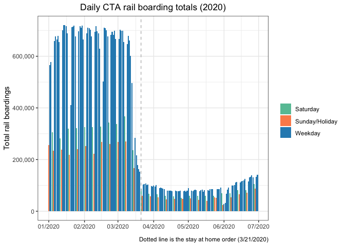

CTA Ridership
================
John Stephen

11/23/2020

I’m going to look at CTA rail ridership during 2020. I want to see how
much of a drop off in ridership occurs during the shelter in place.

``` r
library(dplyr)
library(ggplot2)
library(scales)
library(RSocrata)
library(knitr)
```

### Reading in data

The Chicago data portal has a lot of interesting Chicago data.

<https://data.cityofchicago.org/>

``` r
url = 'https://data.cityofchicago.org/resource/6iiy-9s97.csv'

cta_ridership <- RSocrata::read.socrata(url,stringsAsFactors = FALSE)

cta_ridership$date <- as.Date(cta_ridership$service_date)

kable(head(cta_ridership))
```

| service\_date | day\_type |    bus | rail\_boardings | total\_rides | date       |
| :------------ | :-------- | -----: | --------------: | -----------: | :--------- |
| 2001-01-01    | U         | 297192 |          126455 |       423647 | 2001-01-01 |
| 2001-01-02    | W         | 780827 |          501952 |      1282779 | 2001-01-02 |
| 2001-01-03    | W         | 824923 |          536432 |      1361355 | 2001-01-03 |
| 2001-01-04    | W         | 870021 |          550011 |      1420032 | 2001-01-04 |
| 2001-01-05    | W         | 890426 |          557917 |      1448343 | 2001-01-05 |
| 2001-01-06    | A         | 577401 |          255356 |       832757 | 2001-01-06 |

### Creating weekday/sat/sun variable

``` r
cta_ridership <- cta_ridership %>%
  mutate(day_type_var = case_when(
    day_type == 'W' ~ 'Weekday',
    day_type == 'A' ~ 'Saturday',
    day_type == 'U' ~ 'Sunday/Holiday'
  ))

table(cta_ridership$day_type, cta_ridership$day_type_var)
```

    ##    
    ##     Saturday Sunday/Holiday Weekday
    ##   A     1022              0       0
    ##   U        0           1143       0
    ##   W        0              0    5018

### Interested in 2020

``` r
cta_ridership_2020 <- cta_ridership %>%
  filter(date >= as.Date('2020-01-01') & date <= as.Date('2020-12-31')) 
```

### Graph rail boardings

``` r
## Choosing colors for graph

man_colors <- c('#66c2a4','#fc8d59','#2B8CBE')

## Plotting rail totals
## Dotted line is date of shelter in place in Chicago

ggplot(cta_ridership_2020, aes(x=date, y=rail_boardings, fill = day_type_var)) +
  geom_col() +
  scale_y_continuous(label=comma, name = 'Total rail boardings') +
  scale_x_date(date_breaks = '1 month', date_labels = '%m/%Y', name = element_blank()) +
  theme_bw() +
  scale_fill_manual(values=man_colors) +
  geom_vline(xintercept = as.Date('2020-03-21'), linetype = 'dashed', color = 'grey') +
  labs(title = 'Daily CTA rail boarding totals (2020)',
       fill = element_blank(),
       caption = 'Dotted line is the stay at home order (3/21/2020)') +
  theme(plot.title = element_text(hjust = .5),
        legend.title.align = .5)
```

<!-- -->
